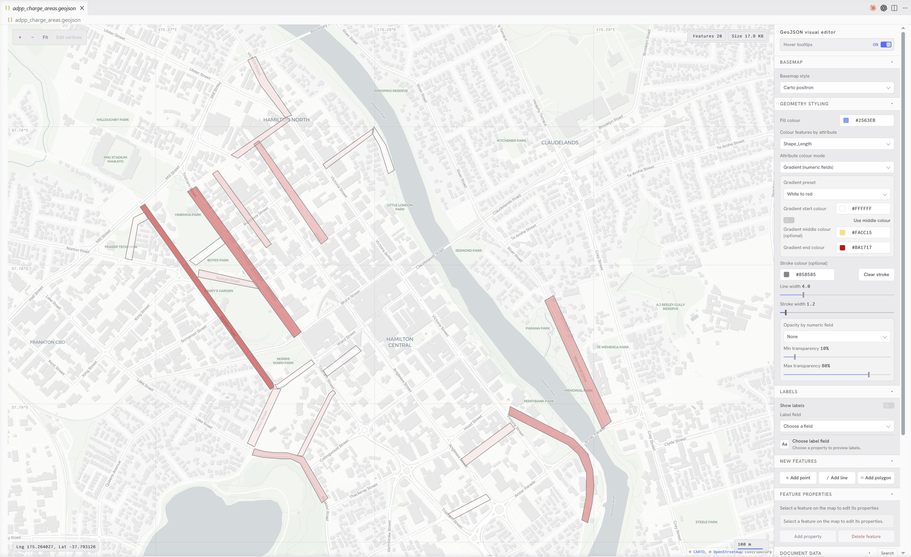

# GeoJSON Visual Editor

GeoJSON Visual Editor adds a custom map-first editor for spatial files in VS Code. It supports GeoJSON documents with live map preview, feature editing tools, and raw text editing in one view.

## Supported Files

- `*.geojson`

The custom editor is registered as the default editor for supported GeoJSON files.

## Current Functionality

### Visual editing and map inspection

- Interactive map preview.
- Built-in pan/zoom controls and a fit-to-features button.
- Feature hover tooltips that can be toggled on or off.
- Live document metrics: feature count and file size.
- Basemap switcher with Carto styles:
  - Positron
  - Voyager
  - Dark Matter

### Geometry styling

- Global styling controls for:
  - Fill color
  - Optional stroke color and stroke width
  - Line width
- Color by attribute (categorical mode).
- Numeric gradient styling with presets and custom gradients.
- Opacity by numeric field using configurable min/max transparency.

### Labels

- Turn on/off map labels using the new **Labels** panel in the right sidebar.
- Choose a `Label field` from available feature properties; the control is disabled until a suitable property exists.
- Labels are rendered for points, along lines, and within polygon centroids where possible. They use a subtle halo and high-contrast text to remain readable over basemaps and are sized responsively by zoom level.
- A small preview card shows an example label value and hints when no values are available.

### Settings

- Configure editor defaults through VS Code Settings UI or `settings.json` under `geojsonVisualEditor.*`.
- Available defaults include UI scale, basemap, fill colour, stroke colour, line width, stroke width, label font family, label size, and whether labels start enabled once a label field is chosen.
- Settings can be configured globally or per workspace. Open editors receive safe setting changes live, and `.geojson` files remain pure GeoJSON without editor preference metadata.

### Feature and property editing

- Add new features from the sidebar:
  - Point
  - LineString
  - Polygon
- Select features directly on the map.
- Delete selected features.
- Edit feature properties:
  - Add property
  - Rename keys
  - Update values (with basic type coercion)
  - Remove property
- Vertex editing mode for selected geometries:
  - Drag markers to move vertices.
  - Left-click near a line segment or polygon edge to insert a new vertex.
  - Right-click a vertex (or its marker) to delete it.
  - The map cursor switches to a crosshair while editing and markers show as red draggable handles.
  - Polygon rings remain closed automatically; deletions that would create invalid geometry are prevented.

### Raw data editing

- Embedded raw document editor with JSON syntax highlighting.
- Coordinate rounding tool (0-10 decimal places).
- Apply workflow validates/normalizes data, updates the map, and saves back to disk.
- Invalid JSON/GeoJSON input is surfaced with clear error messages.



## Commands

| Command                                                                 | Description                                                 |
| ----------------------------------------------------------------------- | ----------------------------------------------------------- |
| `GeoJSON: Open in GeoJSON Visual Editor` (`geojson-visual-editor.open`) | Opens the selected `*.geojson` file with the custom editor. |

## Usage

1. Open a `.geojson` file from the Explorer. You can also run **GeoJSON: Open in GeoJSON Visual Editor**.
2. Inspect and navigate data on the map.
3. Use **Geometry Styling** to tune colors, stroke, gradients, and transparency.
4. Optionally add/remove features, edit vertices, and update properties in the sidebar.

- While in vertex edit mode: left-click near an edge to add a vertex; right-click a vertex to remove it. Drag markers to reposition vertices.

5. Edit raw document data directly if needed.
6. Click **Apply Changes** to save updates to disk.

7. To enable labels: open the **Labels** panel, choose a `Label field`, then enable `Show labels`.

8. To set editor defaults: open VS Code Settings and search for "GeoJSON Visual Editor", or edit `settings.json` directly. Example:

   ```json
   {
     "geojsonVisualEditor.uiScale": 1.15,
     "geojsonVisualEditor.defaultBasemap": "carto-voyager",
     "geojsonVisualEditor.defaultFillColor": "#0ea5e9",
     "geojsonVisualEditor.defaultStrokeColor": "#f8fafc",
     "geojsonVisualEditor.defaultLineWidth": 4,
     "geojsonVisualEditor.defaultStrokeWidth": 1.2,
     "geojsonVisualEditor.defaultLabelsEnabled": false,
     "geojsonVisualEditor.defaultLabelFontFamily": "Open Sans Semibold",
     "geojsonVisualEditor.defaultLabelSize": 12
   }
   ```

## Requirements

An internet connection is required for remote basemap/style assets:

- `https://basemaps.cartocdn.com`
- `https://unpkg.com`

## Known Limitations

- Very large datasets can impact webview and map rendering performance.
- Vertex editing currently focuses on common geometry paths (for multi-geometries, editing is limited to the first editable branch).

## Development

1. Install dependencies:

   ```sh
   npm install
   ```

2. Run the standard checks before testing manually:

   ```sh
   npm run compile
   npm run lint
   npm test
   ```

   `npm test` launches the VS Code extension test runner. On first run it downloads a test copy of VS Code into `.vscode-test/`, which is ignored by git.

3. For day-to-day development, run the TypeScript watcher:

   ```sh
   npm run watch
   ```

4. Start an Extension Development Host from VS Code:
   - Open this folder in VS Code.
   - Press `F5`, or use **Run and Debug** → **Run Extension**.
   - In the Extension Development Host window, open a `.geojson` file.
   - If the file opens as text, run **GeoJSON: Open in GeoJSON Visual Editor** from the Command Palette or use the Explorer context menu.

5. Manual test checklist:
   - Open a valid `.geojson` file and confirm the map renders and fits to the data.
   - Switch basemaps and verify the geometry, labels, metrics, graticule, scale, and coordinate readout continue to update.
   - Change fill, stroke, line width, attribute colouring, gradients, opacity, and labels.
   - Select a feature, add/edit/remove properties, then click **Apply changes** and confirm the file is saved.
   - Add a point, line, and polygon from the sidebar.
   - Enter vertex edit mode, drag vertices, insert vertices with left-click, and delete vertices with right-click.
   - Paste invalid JSON in the document editor and confirm the error is specific and the extension does not crash.
   - Test in both dark and light VS Code themes to verify Cartograph Night/Day styling.

6. To test the packaged extension, build a VSIX:

   ```sh
   npm run package:vsix -- --out /private/tmp/geojson-visual-editor.vsix
   code --install-extension /private/tmp/geojson-visual-editor.vsix
   ```

   The package uses `.vscodeignore` so source files, tests, maps, and `.vscode-test/` are excluded from the VSIX.

7. To publish a downloadable VSIX in GitHub Releases:
   - Bump the version in `package.json` and `package-lock.json`.
   - Update `CHANGELOG.md`.
   - Run `npm test`.
   - Commit and push the release changes.
   - Create and push a matching git tag such as `v0.6.2`.
   - GitHub Actions will build `geojson-visual-editor-0.6.2.vsix` and attach it to the corresponding GitHub Release.

## Release Notes

See `CHANGELOG.md` for version history.
